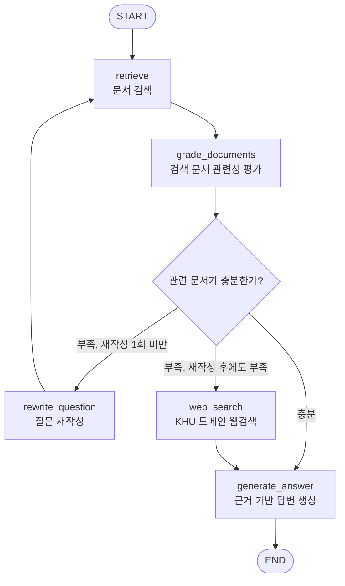

# 대학 학사행정 Agentic RAG Graph

KHU 대학행정 매뉴얼 PDF 등 학사행정 문서를 검색하고, 검색 결과가 부족하면 질문 재작성 후 재검색하며, 그래도 부족하면 KHU 도메인 웹검색을 보조 근거로 검토하는 흐름입니다.

## Graph Diagram

## Detailed Flow

1. `retrieve`: 현재 질문과 최대 8개 이전 대화 메시지를 결합해 벡터 DB에서 학사행정 문서를 검색합니다.
2. `grade_documents`: 검색된 각 문서를 LLM grader가 `yes/no`로 평가합니다. 질문에 답하는 데 구체적으로 도움이 되는 문서만 `yes`입니다.
3. `충분성 기준`: `yes`로 평가된 관련 문서 수가 `ACADEMIC_RAG_MIN_RELEVANT_DOCS` 이상이면 충분하다고 판단합니다. 기본값은 1개입니다.
4. `rewrite_question`: 충분하지 않고 아직 재작성하지 않았다면, 이전 대화 맥락을 반영해 검색용 질문을 한 번 재작성합니다.
5. `web_search`: 재작성 후에도 충분하지 않으면 `site:khu.ac.kr` 조건으로 웹검색을 수행합니다. 도메인은 `ACADEMIC_RAG_WEB_SEARCH_DOMAIN`으로 바꿀 수 있습니다.
6. `generate_answer`: 내부 문서를 최우선 근거로 사용하고, 웹검색 결과는 내부 문서가 부족할 때 보조 근거로만 사용해 한국어 답변을 생성합니다.
