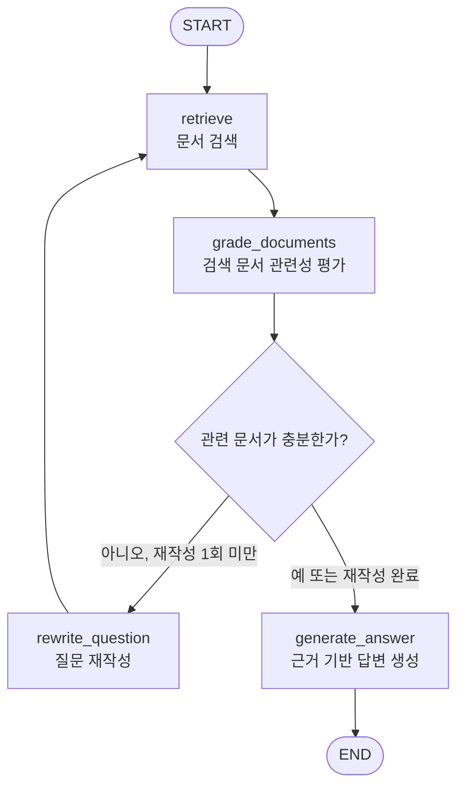

# 대학 학사행정 Agentic RAG Graph

KHU 대학행정 매뉴얼 PDF 등 학사행정 문서를 검색하고, 검색 결과가 부족하면 질문을 재작성한 뒤 답변을 생성하는 Agentic RAG 흐름입니다.

```mermaid
flowchart TD
    START([START])
    RETRIEVE["retrieve<br/>문서 검색"]
    GRADE["grade_documents<br/>검색 문서 관련성 평가"]
    DECIDE{"관련 문서가 충분한가?"}
    REWRITE["rewrite_question<br/>질문 재작성"]
    GENERATE["generate_answer<br/>근거 기반 답변 생성"]
    END([END])

    START --> RETRIEVE
    RETRIEVE --> GRADE
    GRADE --> DECIDE
    DECIDE -- "아니오, 재작성 1회 미만" --> REWRITE
    REWRITE --> RETRIEVE
    DECIDE -- "예 또는 재작성 완료" --> GENERATE
    GENERATE --> END
```
