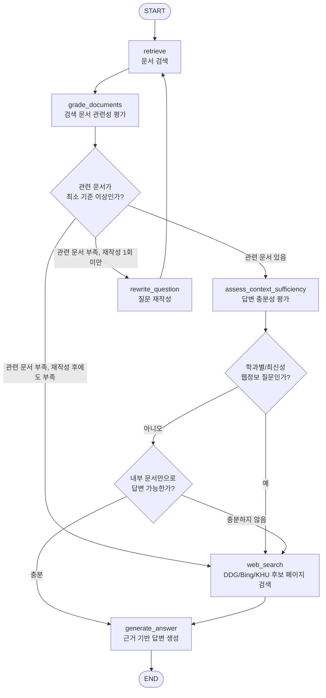

# 대학 학사행정 Agentic RAG Graph

KHU 대학행정 매뉴얼 PDF 등 학사행정 문서를 검색하고, 문서가 관련되어 있더라도 질문에 답하기에 충분하지 않거나 학과별 졸업학점처럼 웹 공개 최신 정보가 필요한 질문이면 KHU 도메인 웹검색을 보조 근거로 검토하는 흐름입니다.

## Graph Diagram

## Detailed Flow

1. `retrieve`: 현재 질문과 최대 8개 이전 대화 메시지를 결합해 벡터 DB에서 학사행정 문서를 검색합니다.
2. `grade_documents`: 검색된 각 문서를 LLM grader가 `yes/no`로 평가합니다. 이 단계는 문서가 질문 주제와 관련 있는지를 판단합니다.
3. `관련성 기준`: `yes`로 평가된 문서 수가 `ACADEMIC_RAG_MIN_RELEVANT_DOCS` 이상이면 다음 단계로 진행합니다. 기본값은 1개입니다.
4. `rewrite_question`: 관련 문서가 부족하고 아직 재작성하지 않았다면, 이전 대화 맥락을 반영해 검색용 질문을 한 번 재작성합니다.
5. `강제 웹검색 기준`: 학과/전공과 졸업학점, 이수학점, 전공학점, 교육과정, 졸업요건이 함께 등장하거나 최신 공지, 일정, URL, 링크, 양식처럼 웹 공개 정보가 필요한 질문이면 내부 문서가 일부 검색되어도 웹검색으로 보냅니다.
6. `assess_context_sufficiency`: 강제 웹검색 대상이 아니더라도 관련 문서만으로 구체적인 답변이 가능한지 다시 평가합니다. 현재 공지, 일정, URL, 양식처럼 변경 가능성이 큰 질문은 내부 문서에 명확한 근거가 없으면 부족하다고 판단합니다.
7. `web_search`: 관련 문서가 재검색 후에도 부족하거나, 관련 문서는 있지만 답변 충분성이 낮으면 `site:khu.ac.kr` 조건으로 검색합니다. DuckDuckGo가 차단되면 Bing 검색, 경희대/학과 후보 페이지 직접 조회 순서로 보완합니다. 도메인은 `ACADEMIC_RAG_WEB_SEARCH_DOMAIN`으로 바꿀 수 있습니다.
8. `generate_answer`: 내부 문서를 최우선 근거로 사용하고, 웹검색 결과는 내부 문서가 부족할 때 보조 근거로 사용해 한국어 답변을 생성합니다.
