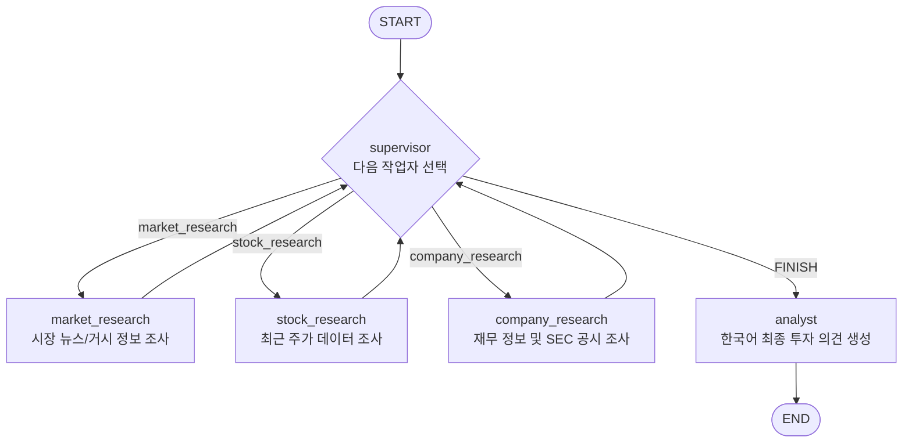

# 주식 분석 Multi-Agent Graph

Supervisor가 시장 조사, 주가 조사, 기업 재무 조사 agent를 순차적으로 호출하고, 최종 analyst가 한국어로 매수/매도/보유 판단을 생성하는 흐름입니다.

```mermaid
flowchart TD
    START([START])
    SUPERVISOR{"supervisor<br/>다음 작업자 선택"}
    MARKET["market_research<br/>시장 뉴스/거시 정보 조사"]
    STOCK["stock_research<br/>최근 주가 데이터 조사"]
    COMPANY["company_research<br/>재무 정보 및 SEC 공시 조사"]
    ANALYST["analyst<br/>한국어 최종 투자 의견 생성"]
    END([END])

    START --> SUPERVISOR
    SUPERVISOR -- "market_research" --> MARKET
    SUPERVISOR -- "stock_research" --> STOCK
    SUPERVISOR -- "company_research" --> COMPANY
    SUPERVISOR -- "FINISH" --> ANALYST
    MARKET --> SUPERVISOR
    STOCK --> SUPERVISOR
    COMPANY --> SUPERVISOR
    ANALYST --> END
```
